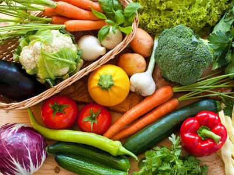

# FOOD API

<p align="center">
  
</p>

## Description
식품 영양 성분을 살펴보는 API 입니다.

[식품의약품안전처](https://various.foodsafetykorea.go.kr/nutrient/)에서 제공하는 식품 영양 성분 DB는 조리식품과 국내에 유통되는 가공식품 등에 대해 수집·분석한 정보로 구성되어 있습니다.

[Nest](https://github.com/nestjs/nest) framework TypeScript starter repository.

## Installation

```bash
$ yarn install
```

## Running the app

```bash
# development
$ yarn run start

# watch mode
$ yarn run start:dev

# production mode
$ yarn run start:prod
```

## Test

```bash
# unit tests
$ yarn run test

# e2e tests
$ yarn run test:e2e

# test coverage
$ yarn run test:cov
```

## Support

Nest is an MIT-licensed open source project. It can grow thanks to the sponsors and support by the amazing backers. If you'd like to join them, please [read more here](https://docs.nestjs.com/support).

## Stay in touch

- Author - [Kamil My힄liwiec](https://kamilmysliwiec.com)
- Website - [https://nestjs.com](https://nestjs.com/)
- Twitter - [@nestframework](https://twitter.com/nestframework)

## License

Nest is [MIT licensed](LICENSE).
